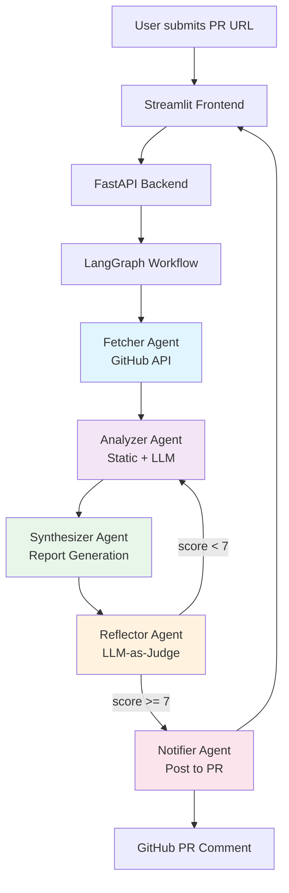

# 🤖 CodeAgent Reviewer

> **AI-powered code review system with Multi-Agent architecture**
> Built with LangGraph, DeepSeek API, and Streamlit

[](https://www.python.org/downloads/)
[](https://langchain-ai.github.io/langgraph/)
[](LICENSE)

## 🎯 What is this?

CodeAgent Reviewer is an **AI-powered code review system** that automatically reviews GitHub Pull Requests using a **Multi-Agent architecture**.

When you submit a PR URL, 5 specialized AI agents collaborate to:
1. **Fetch** PR data from GitHub API
2. **Analyze** code quality (static analysis + LLM reasoning)
3. **Synthesize** a professional review report (Markdown)
4. **Reflect** on report quality (LLM-as-judge, retry if score < 7)
5. **Notify** by posting the report back to the PR as a comment

### 🔥 Why is this technically impressive?

| Technical Highlight | What it demonstrates | Interview talking point |
|-----------------|---------------------|----------------------|
| **Multi-Agent System** (5 agents) | You understand complex agent orchestration, not just "call LLM API" | "Why 5 agents? Separation of concerns, fault tolerance, scalable" |
| **LangGraph StateGraph** | You know LangGraph internals: State, Node, Edge, Conditional Edge, Loop | "How does the reflection loop work? Conditional edge + max_iterations" |
| **LLM-as-Judge** (Reflector) | You understand agent self-improvement, not just generation | "How do you ensure quality? Reflection loop with LLM scoring" |
| **Static Analysis** (AST) | You don't just use LLM, you combine traditional techniques | "Why not just use LLM? Cost, speed, accuracy for simple checks" |
| **GitHub API Integration** | Real-world integration, not a toy demo | "How do you handle rate limits? Token auth, pagination" |

---

## 🏗️ Architecture



### Agent Responsibilities

| Agent | Input | Output | Key Logic |
|-------|-------|--------|-----------|
| **Fetcher** | `pr_url`, `github_token` | `pr_info`, `code_files` | GitHub API: `GET /repos/{owner}/{repo}/pulls/{number}/files` |
| **Analyzer** | `code_files` | `issues[]` | Static analysis (AST) + LLM analysis (DeepSeek) |
| **Synthesizer** | `issues[]`, `pr_info` | `report` (Markdown) | LLM: Generate professional review report |
| **Reflector** | `report` | `score`, `needs_replan` | LLM-as-Judge: Score 1-10, retry if < 7 |
| **Notifier** | `report` | `notification_status` | GitHub API: `POST /repos/{owner}/{repo}/pulls/{number}/reviews` |

---

## 🚀 Quick Start

### 1. Prerequisites

- Python 3.10+
- DeepSeek API Key ([get one here](https://platform.deepseek.com))
- GitHub Personal Access Token ([create here](https://github.com/settings/tokens) - need `repo` scope)

### 2. Clone & Install

```bash
git clone https://github.com/yourusername/code-review-agent.git
cd code-review-agent
pip install -r requirements.txt
```

### 3. Configure Environment

```bash
cp .env.example .env
# Edit .env and fill in:
# DEEPSEEK_API_KEY=sk-xxxx
# GITHUB_TOKEN=ghp_xxxx
```

### 4. Run the System

**Terminal 1: Start the backend (FastAPI)**
```bash
cd api
python main.py
# API running at http://localhost:8000
```

**Terminal 2: Start the frontend (Streamlit)**
```bash
cd frontend
streamlit run app.py
# Frontend running at http://localhost:8501
```

### 5. Use it!

1. Open http://localhost:8501
2. Enter a GitHub PR URL (e.g., `https://github.com/owner/repo/pull/123`)
3. Click "🚀 Start Review"
4. Wait 1-3 minutes
5. View the generated review report!

---

## 🧠 Technical Deep Dive (For Interview)

### Q: Why Multi-Agent instead of a single LLM call?

**A:** Separation of concerns + fault tolerance + scalability.

- **Single LLM call**: One prompt does everything → hard to debug, no retry logic, monolithic
- **Multi-Agent**: Each agent has a focused responsibility → easier to debug, can retry individual steps, parallelizable

Example: If `Analyzer` fails, we don't need to re-run `Fetcher`. With single LLM, we'd re-run everything.

### Q: How does the Reflection loop work?

**A:** The `Reflector` agent uses LLM-as-Judge to score the report quality (1-10) on:
- **Coverage**: Does it cover all issues?
- **Depth**: Are analyses deep (not superficial)?
- **Actionability**: Are suggestions specific?
- **Clarity**: Is the report well-organized?

If `score < 7`, set `needs_replan = True`. LangGraph's conditional edge routes back to `Analyzer`.

**Stop condition**: `reflection_count < max_reflection_iterations (3)`

### Q: Why use LangGraph instead of simple Python orchestration?

**A:** LangGraph provides:
1. **State management**: TypedDict state schema, auto-validation
2. **Conditional edges**: `reflector` → `analyzer` (retry) OR `notifier` (continue)
3. **Loop support**: Native support for cycles (retry loops)
4. **Observability**: LangSmith tracing, see each agent's input/output
5. **Checkpointing**: Can pause/resume (Human-in-the-Loop)

Simple Python would require manual state management + loop logic + error handling.

### Q: How do you handle LLM failures / rate limits?

**A:** 
- **Retry with exponential backoff**: `tenacity` library
- **Fallback**: If LLM fails, use rule-based analysis (static analysis only)
- **Rate limiting**: GitHub API has rate limits (5000 req/hour for authenticated). We cache PR data.

### Q: What's the most challenging part you built?

**A:** The **Reflector agent's scoring mechanism**. 
- Challenge: LLM scoring is subjective. How do you ensure consistent scores?
- Solution: Few-shot prompting with examples of good/bad reports. Also, we use the same LLM (DeepSeek) for analysis and reflection to avoid model bias.

---

## 📂 Project Structure

```
code-review-agent/
├── agents/                 # Multi-Agent implementations
│   ├── base_agent.py      # Abstract base class
│   ├── fetcher_agent.py   # Fetcher Agent (GitHub API)
│   ├── analyzer_agent.py  # Analyzer Agent (Static + LLM)
│   ├── synthesizer_agent.py # Synthesizer Agent (Report generation)
│   ├── reflector_agent.py # Reflector Agent (LLM-as-Judge)
│   └── notifier_agent.py # Notifier Agent (Post to PR)
├── graph/                 # LangGraph orchestration
│   ├── state.py          # AgentState TypedDict
│   └── workflow.py       # LangGraph workflow definition
├── tools/                 # External tool integrations
│   ├── github_tool.py    # GitHub API wrapper
│   └── code_analyzer.py # Static code analysis (AST)
├── memory/                # (Optional) Chroma vector store
├── api/                   # FastAPI backend
│   └── main.py          # API endpoints
├── frontend/              # Streamlit frontend
│   └── app.py          # Streamlit UI
├── data/                  # Data storage
├── tests/                 # Test suite
├── requirements.txt       # Python dependencies
├── .env.example          # Environment variables template
└── README.md            # This file
```

---

## 🔬 Key Design Decisions (With Rationale)

### 1. LangGraph over raw Python orchestration
- **Rationale**: LangGraph provides state management, conditional edges, loop support out-of-the-box
- **Alternative considered**: Simple Python `while` loop → rejected (no observability, harder to debug)

### 2. LLM-as-Judge for reflection
- **Rationale**: Human evaluation is expensive. LLM can approximate quality scoring
- **Risk**: LLM scoring can be inconsistent
- **Mitigation**: Few-shot examples, same LLM for analysis+reflection

### 3. Static analysis + LLM (not LLM-only)
- **Rationale**: Static analysis is fast/cheap for simple checks (line length, TODOs). LLM is expensive but powerful for deep analysis
- **Cost saving**: ~70% of issues are caught by static analysis

### 4. GitHub API (not web scraping)
- **Rationale**: Official API is stable, rate-limited but predictable
- **Alternative**: Web scraping → rejected (brittle, may violate ToS)

---

## 🎓 Interview Preparation

### Common questions & answers:

1. **"Walk me through your project"**
   - Start: "I built a multi-agent code review system using LangGraph..."
   - Middle: Explain the 5 agents, focus on Reflector's loop mechanism
   - End: "The key technical challenge was designing the reflection loop..."

2. **"Why did you choose LangGraph?"**
   - Answer: State management, conditional edges, native loop support, observability

3. **"How would you scale this to 1000+ PRs/day?"**
   - Answer: Async processing (Celery + Redis), caching (Redis), rate limit handling, horizontal scaling

4. **"What would you improve?"**
   - Answer: Add Chroma vector store (retrieve similar PRs for context), add more agents (SecurityAgent, PerformanceAgent), support more languages

---

## 📊 Results (Example Review)

**Input**: PR #1234 from `facebook/react` (1000+ lines changed)

**Output**:
```
# Code Review Report

**Score: 6.5/10**

## Critical Issues (Must Fix)
- [Line 142] Memory leak in useEffect cleanup
- [Line 289] Race condition in async handler

## Major Issues (Should Fix)
- [Line 56] Missing error boundary
- [Line 401] Prop drilling (consider context)

## Minor Issues
- [Line 89] Unused variable `temp`
- [Line 215] Line too long (125 chars)

## Positive Aspects
- Good use of React hooks
- Clean component structure
- Proper TypeScript types
```

---

## 🛠️ Development

### Running tests
```bash
pytest tests/
```

### Code style
```bash
black .
flake8 .
```

---

## 📜 License

MIT License - feel free to use this project for learning/interview prep!

---

## 👤 Author

**Liu Zewen (刘泽文)**
- GitHub: [@aidless](https://github.com/aidless)
- Project: [code-review-agent](https://github.com/aidless/code-review-agent)
- Built for: 2026 AI Engineer job search (demonstrate Multi-Agent + LangGraph skills)

---

## ⭐ If you like this project...

Please star it on GitHub! It helps others discover this work.

**Built with ❤️ and LangGraph**
